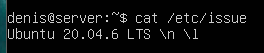
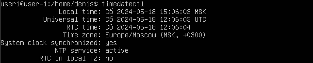
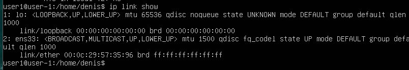
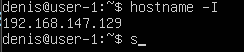
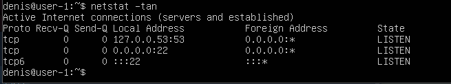

## Part 1. Установка ОС
  

- Установили Ubuntu 22.04.4 Server LTS без графического интерфейса

***

## Part 2. Создание пользователя
  

- Добавили пользователя new_user

- Вывод команды cat /etc/passwd

***

## Part 3. Настройка сети ОС

- Установили временную зону

- Названия сетевых интерфейсов

- Получили ip адрес устройства

- Внешний ip-адрес шлюза (ip) и внутренний IP-адрес шлюза

- настройки ip, gw, dns

- пропинговали удаленные хосты 1.1.1.1 и ya.ru

***

## Part 4. Обновление ОС
  

- Обновили системные пакеты до последней на момент выполнения задания версии

***

## Part 5. Использование команды sudo
  

- Разрешили пользователю, созданному в Part2, выполнять команду sudo

- Вставили скрин с изменённым hostname 

***

## Part 6. Установка и настройка службы времени
  

- служба автоматической синхронизации времени.

***

## Part 7. Установка и использование текстовых редакторов

Установили текстовые редакторы VIM, NANO, MCEDIT

- редактор vim

- редактор nano

***

## Part 8. Установка и базовая настройка сервиса SSHD
  

- Установи службу SSHd.

Используя команду ps, покажи наличие процесса sshd. Для этого к команде нужно подобрать ключи.

- Вывод команды netstat -tan должен содержать  
tcp 0 0 0.0.0.0:2022 0.0.0.0:* LISTEN

***

## Part 9. Установка и использование утилит top, htop

- Установили и запустили утилиты top и htop.
  -CPU
  
  -PID
  
  -MEMORY
  
  -TIME
  

***

## Part 10. Использование утилиты fdisk
- Установили и запустили утилиты fdisk.
  

***
## Part 11. Использование утилиты df

  

  - Запустили команду df.

        размер раздела - 1028772

        размер занятого пространства - 308912

        размер свободного пространства - 6595188

        процент использования - 32%
  

  - Запусти команду df -Th.

        размер раздела - 9.8G

        размер занятого пространства - 3G
        
        размер свободного пространства - 6.3G

        процент использования - 32%
***

## Part 12. Использование утилиты du

    Выведи размер папок /home, /var, /var/log
  

  

  

  

-  вставили скрины с выводом всех использованных команд

***

## Part 13. Установка и использование утилиты ncdu

Выведи размер папок /home, /var, /var/log
    

-  вставили скрины с выводом всех использованных команд

*** 

## Part 14. Работа с системными журналами

Выведи размер папок /home, /var, /var/log

  1. /var/log/dmesg

  

  2. /var/log/syslog

  

  3. /var/log/auth.log

  
  

-  Вставили в отчёт скрин с сообщением о рестарте службы

***